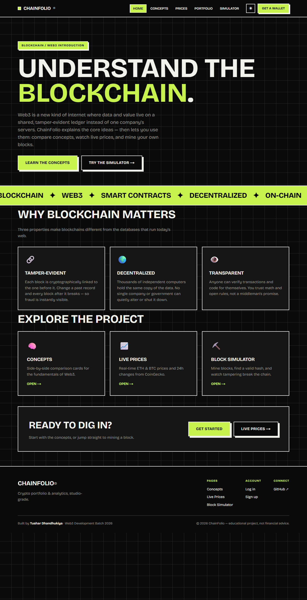
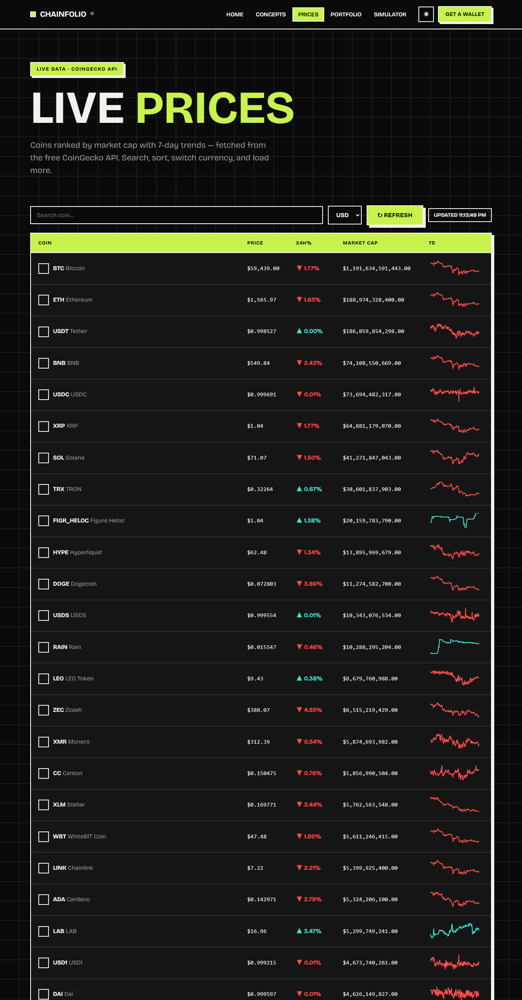
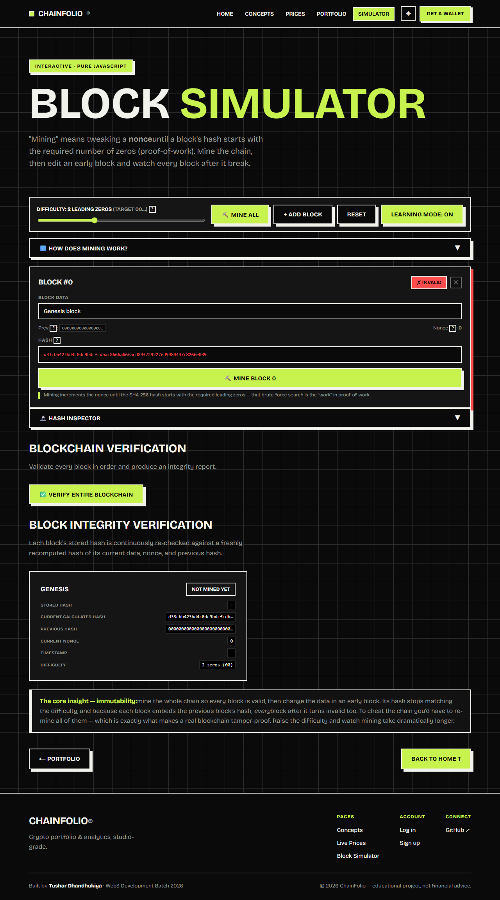

# ChainFolio — Web3 Portfolio & Learning App

A **Next.js** app that goes from explaining blockchain to actually connecting to
Web3. It has a real wallet connection, a live portfolio, a top-20 price
dashboard, and an interactive proof-of-work simulator — wrapped in a dark
**neo-brutalist** theme (with a light mode) and the self-hosted **GANEY** font.

🔗 **Repo:** https://github.com/tushardhandhukiya3080/CHAINFOLIO
🚀 **Deployed on Render** (auto-deploys on push to `main`).

## Features

- **🔌 Wallet connection (wagmi v2 + viem)** — connect MetaMask/injected wallets;
  shows your truncated address and **live ETH balance**; persists across reloads;
  handles no-wallet, user-rejection, wrong-network (switch), and disconnect.
- **💼 Portfolio (`/portfolio`)** — add/edit/remove holdings (saved to
  localStorage), valued live via CoinGecko with per-asset value, **total value**,
  and a **weighted 24h change**; empty/loading/error states.
- **📈 Live Prices (`/prices`)** — top-20 coins by market cap with **7-day
  sparklines**, **search**, **sortable** columns (price / 24h% / market cap), a
  **USD / EUR / INR** switcher, localStorage caching (60s TTL), debounced
  refresh, and graceful **HTTP 429** handling (falls back to cached data).
- **⛏️ Block Simulator (`/simulator`)** — a **5-block** proof-of-work chain; a
  **difficulty slider** (1–4 leading zeros); **time-to-mine** and **hashes/sec**
  per block; tampering with an early block visibly **cascades** down the chain.
- **🧠 Concepts (`/concepts`)** — side-by-side comparison cards (Web2 vs Web3,
  Ethereum vs Bitcoin, Public vs Private Key, Blockchain vs Traditional DB).
- **🏠 Home (`/`)** — blockchain/Web3 intro landing with hero, feature cards, CTA.
- **🌗 Dark / light theme toggle** (no-flash, persisted).
- **🔐 Bonus:** email login/signup pages with a mock auth flow.
- **✅ Unit tests** for the block-hashing function (Vitest).
- Fully **responsive** (hamburger nav, stacking cards, scrollable tables).

## Pages / routes

| Route | Page |
|-------|------|
| `/` | Home / Landing |
| `/concepts` | Concept comparison cards |
| `/prices` | Live top-20 price dashboard |
| `/portfolio` | Personal portfolio tracker |
| `/simulator` | Proof-of-work block simulator |
| `/login`, `/signup` | Bonus mock auth |

## Tech stack
- **Next.js 16** (App Router) + **React 19**, JavaScript.
- **wagmi v2 + viem** + **@tanstack/react-query** for Web3.
- **CoinGecko** free public API (no key, no secrets in the client).
- Self-hosted **GANEY** font via `next/font/local`.
- **Vitest** for unit tests.

```
app/        # routes (home, concepts, prices, portfolio, simulator, login, signup)
components/ # Navbar, Footer, ConnectWallet, ThemeToggle, Sparkline, Card, …
context/    # AuthContext (mock email auth)
lib/        # wagmi config, coingecko helpers, coins list, hash utils + tests
fonts/      # self-hosted Ganey.woff2
```

## How to install and run

Requires Node.js 20+.

```bash
npm install
npm run dev      # http://localhost:3000
npm test         # run unit tests
npm run build    # production build (webpack)
npm run start
```

## Screenshots

> Add screenshots to a `screenshots/` folder and they'll render here.

| Home | Live Prices |
|------|-------------|
|  |  |

| Portfolio | Block Simulator |
|-----------|-----------------|
|  |  |

## Security notes
- No secrets in the client; the CoinGecko public API needs no key.
- The app only ever reads your **public address** and **balance** — it never
  accesses or stores private keys.

## Known issues / future work
- CoinGecko free tier rate-limits aggressively; caching + debouncing mitigate it.
- Mock email auth stores data in `localStorage` (demo only).
- Wallet is read-only (no send/sign) — a natural next step.
